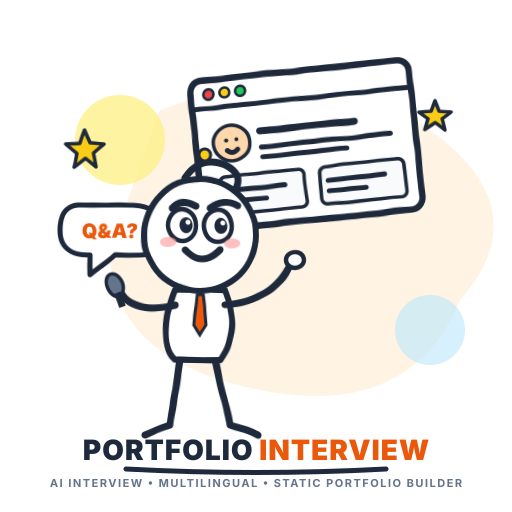
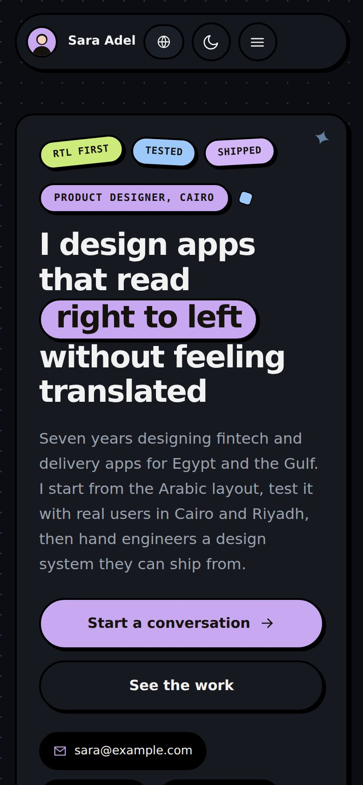
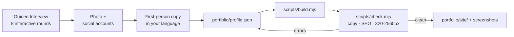

<div align="center">

<picture>
  <source media="(prefers-color-scheme: dark)" srcset="assets/logo-dark.svg">
  
</picture>

# Portfolio Interview

**An autonomous AI agent skill & plugin that interviews you in a few guided rounds, then builds your personal portfolio site: responsive, bilingual (Arabic & English), and engineered for search and AI answer engines.**

<br />

[](LICENSE)
[](https://bun.sh)
[](.codex-plugin/plugin.json)
[](https://claude.ai)
[](https://deepmind.google)
[](https://skills.sh/portfolio-interview)
[](#universal-one-line-installer)
[](#arabic-and-english)
[](scripts/selftest.mjs)

[English](#english) · [العربية](#العربية) · [Brand Identity](docs/brand-identity.md)


  

<sub>Built from the two example profiles in <code>evals/fixtures/</code>: a bilingual product designer, and a Riyadh lawyer in formal Arabic with the calm style.</sub>

</div>

---

## English

### What you get

You answer about eight rounds of multiple-choice popups (or short chat questions when popups are unavailable). Every question accepts custom typed answers. Along the way you add your photo and social accounts. The agent writes the copy, builds the site, checks it, and shows you screenshots before you publish.

| Feature | Description |
|---|---|
| **Fits your field** | 12 field types (developer, designer, marketer, writer, creator, photographer, product, consultant, academic, educator, law/medicine/finance, other). Each one tunes section names, proof priority, visual style, and color palette. |
| **Arabic and English** | One language or both. The Arabic page is fully RTL, crafted in Egyptian or formal Arabic depending on your audience. |
| **Responsive** | Tested with zero horizontal scroll from 320 px to 2560 px, in light and dark mode. Every section remains readable with JavaScript disabled. |
| **Search and AI answers** | Person, ProfilePage, ItemList, and FAQPage JSON-LD, plus hreflang, canonical URLs, Open Graph, `sitemap.xml`, and `llms.txt`. `robots.txt` explicitly allows GPTBot, ClaudeBot, and PerplexityBot. The build can also render a 1200×630 share card. |
| **Anti-slop quality gate** | Automated rejection of fabricated buzzwords ("not just X, it's Y" cliché, buzzword lists, ungrounded superlatives, em dashes), numbers without sources, and unnamed testimonials. |
| **Easy to host** | Static HTML, CSS, and vanilla JS with zero external frontend runtime dependencies. Works out-of-the-box on GitHub Pages, Netlify, Vercel, Cloudflare Pages, or static storage. |
| **Fully Agentic Plugin** | Ships as a certified plugin for **ChatGPT & Codex** (with bundled `host-workspace-operator` for safe host tool usage) and **Claude Code** (with 3 subagents and 2 linting/safety hooks). |

<div align="center">
  
</div>

### Installation

Choose your agent platform or harness. Every method is verified and tested.

#### Universal One-Line Installer

Installs or updates Portfolio Interview across all installed agent environments on your machine (Claude Code, Antigravity, Gemini CLI, OpenAI Codex, OpenCode, Cursor, Windsurf, Agent Kernel):

```bash
curl -fsSL https://raw.githubusercontent.com/imMamdouhaboammar/portfolio-interview/main/install.sh | bash
```

<details open>
<summary><strong>ChatGPT & OpenAI Codex: Plugin (Certified)</strong></summary>

This repository is structured as a compliant Skills-only Codex and ChatGPT Plugin. It includes `.codex-plugin/plugin.json`, portable root `plugin.json`, and bundled skills under `skills/` (`portfolio-interview` and `host-workspace-operator`).

1. **Local Plugin / Developer Mode**:
   Add this repository directory in your ChatGPT Desktop or Codex plugin settings, pointing to `.codex-plugin/plugin.json`.

2. **Package Deterministic ZIP**:
   ```bash
   python3 ~/.gemini/config/skills/chatgpt-codex-plugin-autopilot/scripts/package_plugin.py . /tmp/portfolio-interview-plugin.zip --json
   ```

3. **Validate Architecture**:
   ```bash
   python3 ~/.gemini/config/skills/chatgpt-codex-plugin-autopilot/scripts/validate_plugin.py . --json
   ```

4. **Codex Skill Execution**:
   Start directly in Codex with:
   ```text
   $portfolio-interview
   ```
   Or describe your intent: *"Interview me and build a personal portfolio website."*

</details>

<details>
<summary><strong>Claude Code: Plugin & Marketplace (Recommended)</strong></summary>

Inside Claude Code:

```text
/plugin marketplace add imMamdouhaboammar/portfolio-interview
/plugin install portfolio-interview
```

Then invoke it with `/portfolio-interview`, or tell Claude: *"Build me a portfolio"*.

To test a local checkout directly:
```bash
claude --plugin-dir .
```

This route installs the skill, the [three subagents](#subagents), and the [two hooks](#hooks).

</details>

<details>
<summary><strong>Google Antigravity & Gemini CLI</strong></summary>

Install directly to your Antigravity skills directory:

```bash
git clone https://github.com/imMamdouhaboammar/portfolio-interview.git ~/.gemini/config/skills/portfolio-interview
```

The skill is immediately discovered by Antigravity and Gemini CLI agents. Simply prompt: *"Build my portfolio website"*.

</details>

<details>
<summary><strong>OpenCode, Cursor & Windsurf</strong></summary>

Clone into your global or project `.agents/skills/` directory:

```bash
mkdir -p ~/.agents/skills
git clone https://github.com/imMamdouhaboammar/portfolio-interview.git ~/.agents/skills/portfolio-interview
```

Codex, OpenCode, Cursor, and Windsurf will discover the skill automatically.

</details>

<details>
<summary><strong>Universal Skills.sh: <code>npx skills</code></strong></summary>

```bash
# Install into current project
npx skills add imMamdouhaboammar/portfolio-interview

# Install globally across all supported harnesses
npx skills add imMamdouhaboammar/portfolio-interview -g -y
```

- **Claude Code:** invoke with `/portfolio-interview`.
- **Codex:** invoke with `$portfolio-interview`.

</details>

<details>
<summary><strong>claude.ai (Web and Desktop): Upload a ZIP</strong></summary>

1. Build the deterministic ZIP:
   ```bash
   bun scripts/package.mjs ~/portfolio-interview.zip
   ```
2. Enable code execution: **Settings → Capabilities** (or **Organization settings → Plugins & skills**).
3. Navigate to **Customize → Skills → + → Create skill → Upload a skill** and select the ZIP.
4. Start a chat and say: *"Build me a portfolio"*.

</details>

---

### Subagents

The Claude Code plugin provides three specialized subagents. The primary skill routes tasks to them autonomously, or you can call them directly with `@agent-portfolio-interview:<name>`:

| Subagent | Role & Workflow | Model |
|---|---|---|
| `profile-miner` | Extracts facts from your CV, LinkedIn export, GitHub profile, or existing site into prefilled answers with exact source attribution. Never guesses missing data. | sonnet |
| `portfolio-copywriter` | Crafts all strings in `profile.json` in your selected dialect and language, produces 3 distinct headline variations, validates character limits, and enforces anti-slop rules. | session default |
| `portfolio-qa` | Compiles the site, reviews screenshots like a senior recruiter/client, and reports prioritized improvements tied to `profile.json` keys. Never touches generated files directly. | sonnet |

### Hooks

| Event | Protection Mechanism |
|---|---|
| **PreToolUse (`Write` / `Edit`)** | If an edit targets any file inside the generated build folder (`portfolio/site/`, tagged with `.portfolio-build.json`), the operation is blocked and redirected to `profile.json`. |
| **PostToolUse (on `profile.json`)** | Automatically lints `profile.json` against copy rules, schema constraints, and verification requirements on every save, surfacing issues immediately before build. |

---

### How It Works



| Round | Focus Area |
|---|---|
| **1. Setup** | Language (English/Arabic), field archetype, goal (clients, job, brand, academic), visual theme, Arabic dialect |
| **2. Field** | Specialty, years of experience, hiring audience, target markets |
| **3. Identity** | Name and title (inferred from CV/git with confirmation), city, availability |
| **4. Proof** | Verified project portfolio, quantifiable metrics with sources, authenticated testimonials |
| **5. Photo** | Headshot file path, attachment, URL, or clean initials monogram fallback |
| **6. Socials** | Professional and developer handles, formatted into Schema `sameAs` links |
| **7. Contact** | Approved public email, WhatsApp, custom domain, accent color |
| **8. Review** | Headline, summary, and meta description validation before compiling |

Output is neatly isolated in `./portfolio/`:

```text
portfolio/
  profile.json          your answers, the single source of truth
  avatar.jpg
  site/
    index.html          default language
    ar/index.html       second language, RTL
    assets/             css, js, avatar, og.png, project images
    robots.txt  sitemap.xml  llms.txt  site.webmanifest  404.html
```

---

### Running Scripts Locally

Using **Bun** (preferred) or Node.js:

```bash
# Run unit & validation test suite (27/27 assertions)
bun scripts/selftest.mjs

# Build portfolio site with share card
bun scripts/build.mjs portfolio/profile.json --out portfolio/site --og

# Verify copy, SEO, and responsive layout
bun scripts/check.mjs portfolio/profile.json portfolio/site

# Run profile-only linting (what the hook executes)
bun scripts/check.mjs portfolio/profile.json --profile-only

# Package deterministic skill ZIP
bun scripts/package.mjs portfolio-interview.zip

# Validate ChatGPT/Codex Plugin compliance
python3 ~/.gemini/config/skills/chatgpt-codex-plugin-autopilot/scripts/validate_plugin.py . --json
```

---

### Publishing Your Site

- **GitHub Pages:** Push `site/` to `<user>.github.io` and configure `site.url`.
- **Netlify / Vercel / Cloudflare Pages:** Connect repository or drag the `site/` directory directly into the dashboard.
- **Custom Domain:** Set `site.url` in `profile.json`, rebuild, and configure DNS.

---

## العربية

<div dir="rtl">

### السكيل بيعمل إيه

بتجاوب على حوالي ثماني جولات من الأسئلة التفاعلية (أو في الشات مباشرة حسب المنصة المستخدمة). كل سؤال فيه اختيارات جاهزة وخانة لكتابة إجابتك بحرية. في النص بتضيف صورتك وحساباتك المهنية. بعد كده الـ Agent بيكتب نصوص الموقع بلغتك، ويبني الموقع بالكامل، ويراجعه، ويوريك صور الموقع على الموبايل والديسكتوب قبل ما تنشره.

| الميزة | التفاصيل |
|---|---|
| **مناسب لمجالك** | يدعم 12 مجالاً (مطور، مصمم، مسوق، كاتب، صانع محتوى، مصور، مدير منتج، استشاري، أكاديمي، معلم، محامي/طبيب/مالية، وغيرهم). كل نوع يحدد ترتيب الأقسام، ونوع الإثباتات التي تظهر أولاً، والستايل العام والألوان. |
| **عربي وإنجليزي** | موقع بلغة واحدة أو لغتين معاً. الصفحة العربية تدعم الـ RTL بالكامل، وتكتب بالمصري أو الفصحى حسب جمهورك المستهدف. |
| **متجاوب 100%** | تم اختباره والتأكد من عدم وجود أي تمرير أفقي من شاشات 320px حتى 2560px، في الوضعين الفاتح والداكن، ويعمل بالكامل حتى عند تعطيل JavaScript. |
| **جاهز لمحركات البحث والذكاء الاصطناعي** | يحتوي على بيانات وصفية غنية JSON-LD (Person, ProfilePage, ItemList, FAQPage)، وملفات `sitemap.xml` و`llms.txt` و`robots.txt` المصرح لبوتات ChatGPT وClaude وPerplexity بالدخول إليها، مع توليد صورة مشاركة 1200×630 تلقائياً. |
| **من غير كلام محشو (Anti-Slop)** | يتوقف البناء تلقائياً عند وجود صياغات ركيكة أو مصطنعة مثل "مش مجرد X، ده Y"، أو كلمات مستهلكة، أو أرقام دون مصدر معتمد، أو توصيات مجهولة الاسم. |
| **سهل الاستضافة** | كود HTML وCSS وJS خالص وخفيف جداً بدون أي مكتبات ثقيلة، ويعمل مباشرة على GitHub Pages أو Netlify أو Vercel أو أي استضافة ثابتة. |
| **بلجن Agentic متكامل** | حزمة معتمدة لمنصات **ChatGPT وCodex** (مع أداة `host-workspace-operator` لإدارة الملفات الآمنة) ومنصة **Claude Code** (مع 3 وكلاء متخصصين واثنين من الـ Hooks). |

<br />

### طرق التثبيت

#### أمر التثبيت الشامل التلقائي (One-Line Installer)

يثبت أو يحدث السكيل عبر جميع بيئات الذكاء الاصطناعي المثبتة على جهازك تلقائياً (Claude Code, Google Antigravity, Gemini CLI, OpenAI Codex, OpenCode, Cursor, Windsurf, Agent Kernel):

</div>

```bash
curl -fsSL https://raw.githubusercontent.com/imMamdouhaboammar/portfolio-interview/main/install.sh | bash
```

<div dir="rtl">

<details open>
<summary><strong>في ChatGPT وOpenAI Codex (بلجن معتمد)</strong></summary>

الريبو مهيأ بالكامل كـ Skills-only Plugin متوافق مع معايير OpenAI من خلال `.codex-plugin/plugin.json` وملف `plugin.json` الرئيسي، بالإضافة للمهارات المدمجة في `skills/`:

1. **الوضع المحلي / وضع المطورين**: أضف مجلد الريبو في إعدادات البلجن في ChatGPT Desktop أو Codex، حيث يتعرف تلقائياً على `.codex-plugin/plugin.json`.
2. **حزم ملف ZIP معتمد**:
   ```bash
   python3 ~/.gemini/config/skills/chatgpt-codex-plugin-autopilot/scripts/package_plugin.py . /tmp/portfolio-interview-plugin.zip --json
   ```
3. **التشغيل المباشر في Codex**:
   ```text
   $portfolio-interview
   ```
   أو اطلب في المحادثة: *"اعملي بورتفوليو احترافي ثنائي اللغة"*.

</details>

<details>
<summary><strong>في Claude Code (بلجن كامل مع Subagents وHooks)</strong></summary>

داخل Claude Code نفذ:

```text
/plugin marketplace add imMamdouhaboammar/portfolio-interview
/plugin install portfolio-interview
```

بعدها شغّله بأمر `/portfolio-interview` أو قل له: *"اعملي بورتفوليو"*.

لتجربة المجلد المحلي مباشرة:
```bash
claude --plugin-dir .
```

</details>

<details>
<summary><strong>في Google Antigravity وGemini CLI</strong></summary>

استنسخ الريبو مباشرة في مسار مهارات Antigravity:

```bash
git clone https://github.com/imMamdouhaboammar/portfolio-interview.git ~/.gemini/config/skills/portfolio-interview
```

وسيتعرف عليه النظام فوراً عند طلب بناء موقع شخصي.

</details>

<details>
<summary><strong>في OpenCode وCursor وWindsurf</strong></summary>

استنسخ الريبو في مجلد المهارات العام أو الخاص بالمشروع:

```bash
mkdir -p ~/.agents/skills
git clone https://github.com/imMamdouhaboammar/portfolio-interview.git ~/.agents/skills/portfolio-interview
```

</details>

<details>
<summary><strong>على claude.ai (الويب وسطح المكتب)</strong></summary>

1. أنشئ ملف الـ ZIP بالأمر:
   ```bash
   bun scripts/package.mjs ~/portfolio-interview.zip
   ```
2. فعّل تنفيذ الأكواد من **Settings ← Capabilities**.
3. ارفع الملف من **Customize ← Skills ← + ← Create skill ← Upload a skill**.
4. ابدأ محادثة جديدة وقل له: *"اعملي بورتفوليو"*.

</details>

---

### بنية المشروع الداخلية

</div>

```text
SKILL.md                  تعليمات المهارة الأساسية للوكيل الذكي
.codex-plugin/            ملف إعداد بلجن OpenAI Codex وChatGPT
plugin.json               ملف تعريف البلجن الشامل الموحد
skills/                   المهارات المدمجة (portfolio-interview وhost-workspace-operator)
assets/                   شعار الدودل الفكاهي (فاتح/داكن/أيقونة) وقوالب الموقع
references/               أدلة المقابلات، ومخطط البيانات، وقواعد الكتابة، وتحسين محركات البحث
scripts/                  أدوات البناء والمراجعة والاختبار والحزم (Bun/Node)
agents/                   الوكلاء المتخصصون الثلاثة لـ Claude Code
hooks/                    قواعد الحماية ومراجعة جودة النصوص تلقائياً
evals/fixtures/           ملفات أمثلة عملية لمصمم ثنائي اللغة ومحامٍ بالرياض
docs/                     دليل الهوية البصرية وصور الشاشات التوضيحية
```

<div dir="rtl">

### بعد النشر

1. أضف رابط الموقع الجديد في خانة Website على كل حساباتك المهنية (LinkedIn, GitHub, X) لربط الهوية الرقمية في محركات البحث.
2. سجّل الموقع في Google Search Console وBing Webmaster Tools، وارفع ملف `sitemap.xml`.
3. لتعديل أي بيانات لاحقاً، عدّل ملف `portfolio/profile.json` وأعد البناء بالأمر الموضح أعلاه. لا تعدل ملفات HTML مباشرة لأن البناء التالي سيعيد كتابتها.

</div>
